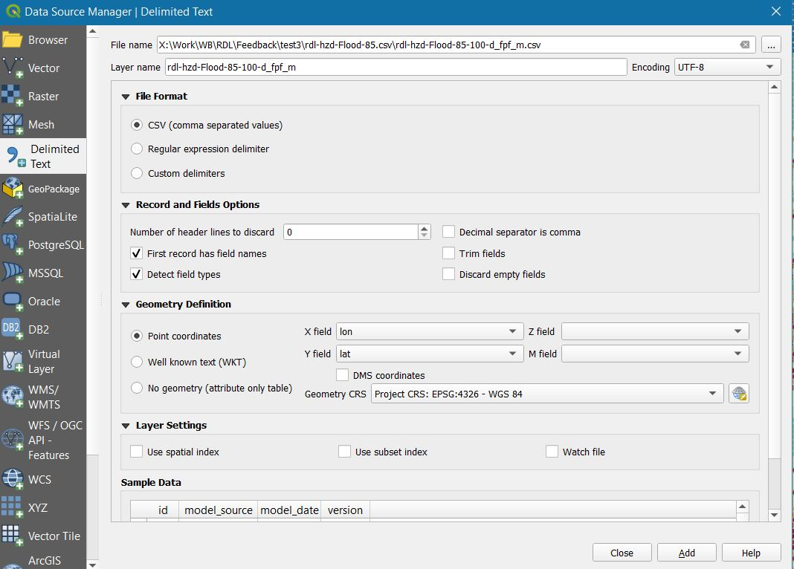
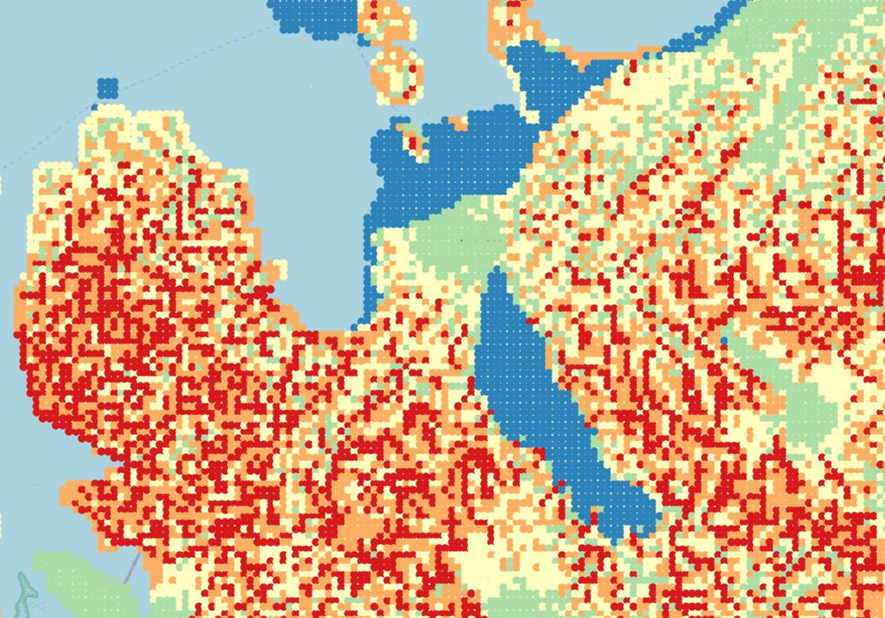
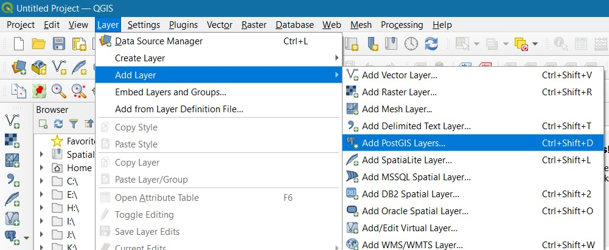
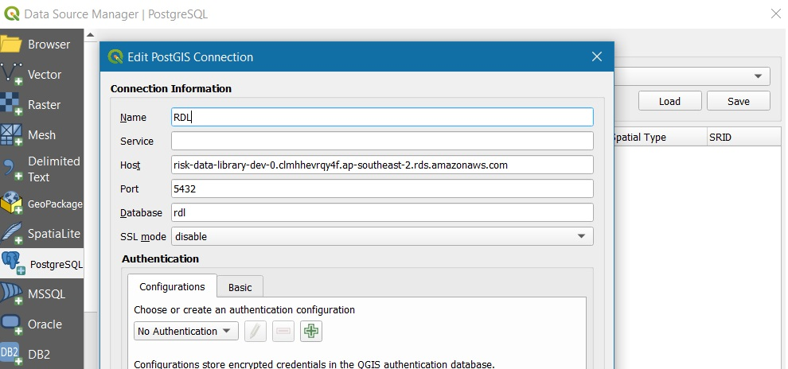
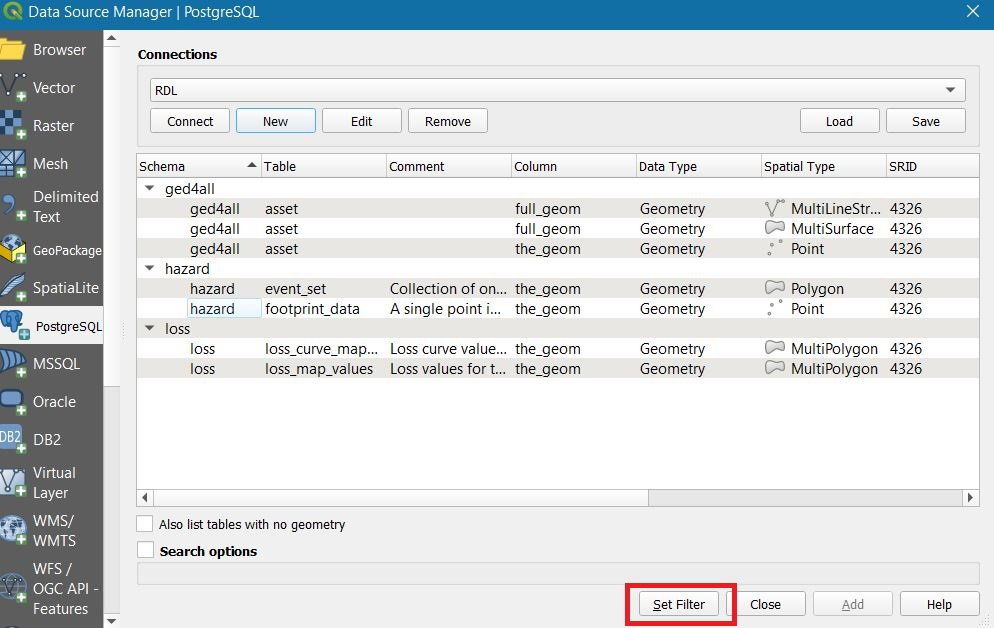
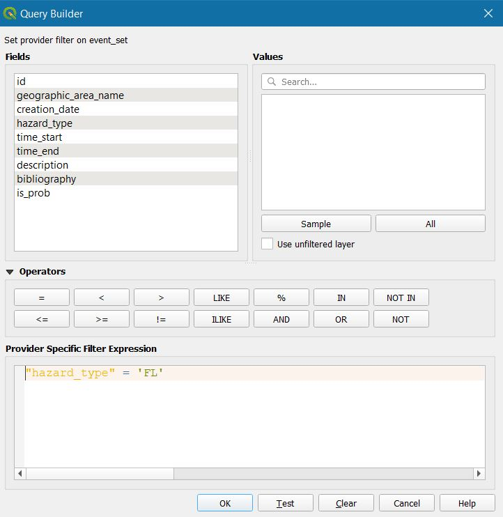
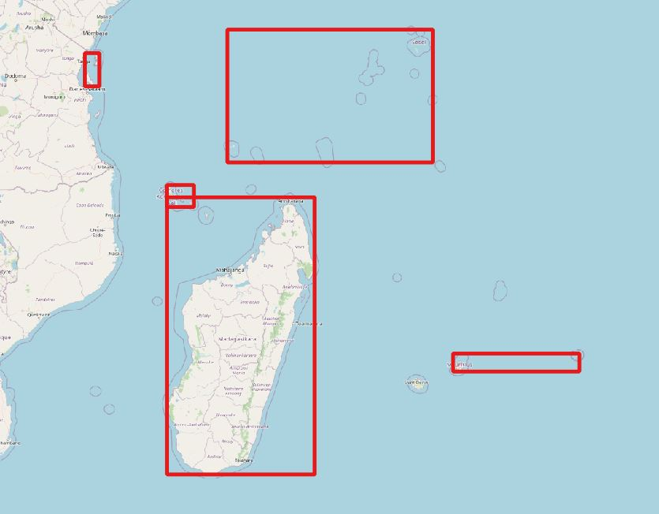

# Data access and usage
The data hosted by the RDL database can be accessed in different ways. Datasets for each of the schemas are listed in the [Data page](http://riskdatalibrary.org/data) for direct download as CSV or GEOJSON, but the PosGIS database can also be accessed via GIS software or scripting languages such as R and Python.

**PLEASE NOTE:** this section is Work In Progress

## Web download
Example for hazard data:

The CSV files can be imported as "*delimited text layer*" in QGIS.

Large layers can take a while to import. Once imported in QGIS, it can be saved as shapefile or further converted into grid data.

## PostGIS
Data can be added from the PostGIS server to GIS software. The example is provided for QGIS, the most used free GIS software.

Add layer from PostGIS > New connection > Enter details > Ok > Connect  
The connection details are set like in the picture below. 
**NOTE**: the access is not public at the moment, it requires credentials.

	Host: "risk-data-library-dev.cluster-clmhhevrqy4f.ap-southeast-2.rds.amazonaws.com"
	Port: "5432"
	Database: "rdl"

Upon connect, each schema database is listed as collection of points, lines or polygons. This represents the whole content of the database.

In order to select and download only the dataset of interest, you can use a filter to make a specific query. Select the database from where you want to download features and click **set filter**. Use the attributes to limit the selection. In the example, we look at the extents of flood hazard datasets.

We can look at the data table and see which footprint datasets are listed. Use this information to select some specific footprints, e.g. those in Comoros islands.

**WORK IN PROGRESS**

## R and Python

## API endpoint