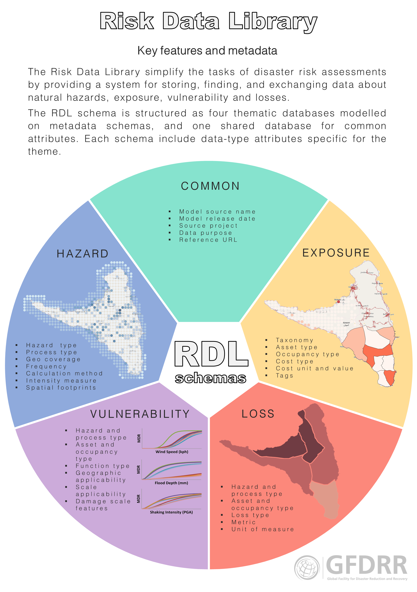

# Risk Data Library documentation

This documentation refers to .

## General aim

The Risk Data Schema [(riskdatalibrary.org)](http://riskdatalibrary.org) is a language for describing hazard, exposure, vulnerability and modelled loss data. It provides:

- a consistent framework for describing the most common types of data used in risk assessment.
- a database that stores all four data types together, with explicit links for data generated under the same project.
- a connection between technically compatible datasets, e.g. hazard and vulnerability data with matching applicability.

The RDL helps anyone working with or creating risk data (particularly disaster risk analysts and researchers preparing data for risk assessment), by making datasets significantly easier to identify, understand and work with, as they are formatted with a common schema tailored to the requirements of risk modelling.

## Schema benefits
- A single consistent nomenclature for hazard, exposure, vulnerability and modelled loss datasets simplifies the task of preparing data for risk assessments.
- Enables storage of risk data for accessible sharing with the community.
- All data is stored with metadata focussed on providing the information required to assess its suitably for risk modelling projects including source, licence, development method, units, and hazard processes it relates to.
- Built-in machine- and human-readable metadata makes it easier to understand the data contents and lays the foundation for data search and for future automation.
- [Free and open-source](https://github.com/GFDRR/rdl-data/) for community improvement of the schema and development of a project database.
- The schema can provide a consistent data source for analytical and visualisation applications, accessing data via OpenAPI.

---

## Use cases
1. An academic research team has generated new risk information and needs to demonstrate the impact of their work, and make the data available for others access. They can upload the data in a consistent format with comprehensive metadata according to the schema, set up a library database using the open source code, and establish a project data library. Value: The pre-designed open-source deployable solutions can assist a research group achieve impact efficiently.

2. A risk analyst is scoping a risk assessment or risk reduction project and would like to identify what risk data exists in their project location. By accessing the Risk Data Library they can see what data is available for that area from the World Bank. Using the comprehensive metadata, they can summarise the existing information and assess whether the data is suitable use or invest in improving it. Value: Reduced time taken to find existing data. Bespoke metadata provides information that the risk analysts needs to make decisions on usage.

3. A development bank produces public good dashboards to deliver risk insights to clients. These dashboards ingest various risk data from their projects and open sources. By making use of the Risk Data Library APIs, each of the dashboards can access the required datasets on request form one or more libraries, display the data as required and reference selected metadata to inform client decisions. Value: Efficient data pipelines to ingest multiple datasets with confidence in the consistency of data structure and metadata.

---

## Reasons for confidence in the schema as a solution

- Developed by experts in generating and using hazard, exposure, vulnerability and modelled loss data
- The solution delivers on findings of community consultation on how to make risk data easier to work with, responding to the needs of the risk community
- Community feedback has been sought and acted on throughout the project
- Early expert reviews of the schema have confirmed the value and informed development
- The proliferation of data management and interoperability initiatives in DRM and insurance sectors shows an ongoing for this type of solution

---

## The importance of adoption & application
- The value of the schema multiplies with use. The more datasets using the schema, the greater its overall contribution.
- Without widespread adoption, the schema’s benefits will be limited to teams and projects that use it.